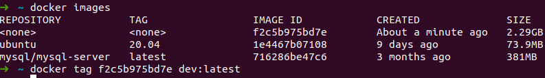
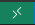
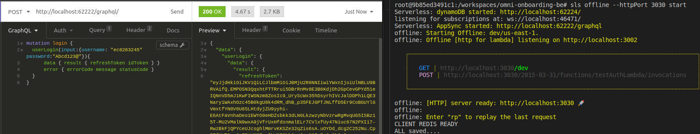

# OMNI GraphQL API 2022

- OMNI is a unit trust digitization project which has several module covering end to end client onboarding and transaction process.
- This repository covers the Back Office operations.

## Initial Setup

### 1. Configuring AWS CLI (Region: ap-southeast-1)

- Install AWS CLI as per link: https://docs.aws.amazon.com/cli/latest/userguide/cli-chap-install.html
- Then set the access key, secret and region for the AWS: `aws configure`

### 2. Local DynamoDB

- Setup DynamoDB as per link: https://docs.aws.amazon.com/amazondynamodb/latest/developerguide/DynamoDBLocal.html
- CLI Reference: https://docs.aws.amazon.com/cli/latest/reference/dynamodb/index.html

### 3. Local MySQL (v8.0.23)

- Setup MySQL as per link: https://www.prisma.io/dataguide/mysql/setting-up-a-local-mysql-database

### 4. Installing VSCode

- Install as per link: https://code.visualstudio.com/docs/setup/linux
- Install these extensions:

```
Document This             // for function documentation
EsLint                    // for linting
Prettier                  // for linting
Typescript Hero           // for linting
Code Spell Checking       // for spell checks
TODO Highlight            // colouring for TODO, NOTE, etc. in codes
Git Graph                 // for viewing git timeline and easier to pull/push/commit/rebase
GraphQL                   // for .gql files
GitLens                   // for viewing last edited in codes
```

## Development

### 1. Installation

- Clone the repo: `git clone https://github.com/regovtech/omni-onboarding-backoffice-be.git`
- Install node (v12.21.0) as per link: https://www.digitalocean.com/community/tutorials/how-to-install-node-js-on-ubuntu-20-04
- Install all dependencies:

```
npm install
```

### 2. Serverless Setup (Endpoint Creation)

- In [schema.graphql](schema.graphql)
  - Define the input and output types
  - Define the query/mutation
- Create vtl file in folder [mapping-templates](mapping-templates) (filename should be all lowercase)
- In [serverless.yml](serverless.yml) add endpoint entry referring to vtl file. Copy and update following:

```
- dataSource: sourceLambda
  - type: [Query/Mutation]
  - field: '<endpointName>'
  - request: '<endpointName>.request.vtl' // go to mapping-templates folder
  - response: 'global.response.vtl'
```

- In [routes.ts](src/routes.ts) add function blue print for the Resolvers.
  - Import code file
  - Add template function (function name is all lowercase)
  - Add function name to AuthReq constant (all lowercase)
- In [permission-mappings.ts](utils/mappings/permission-mappings.ts) add permission of the endpoint to the respective module (all lowercase)

### 3. Run

- Start local dynamoDB
- Ensure .env file is set up according to `utils/env_constants.ts` and recheck that `ENV=LOCAL`
- Start BackofficeWeb:

```
npm run build:sls
```

- API Documentation: https://drive.google.com/drive/folders/1UT7ymbdg1zNXqzPKYGkfN2tMtBDvuyOm
- Description of scripts listed in **package.json**, `scriptComments`

## Deployment

### 1. Using Command Line (with node_modules)

- Go to the build directory and include the node dependencies (note that this will increase overtime):

```
npm install -- production
```

- Zip all inside the build folder, name the zip file base on the lambda function for consistency:

```
zip -r <LambdaFunctionName>.zip .
```

- Upload using the AWS CLI:

```
aws lambda update-function-code --function-name <LambdaFunctionName> --zip-file fileb:/<LambdaFunctionName>.zip
```

### 2. Using Command Line v2 (without node modules)

In main directory,

1. To deploy:`npm run easy:deploy`
2. To create module layer:`npm run layer:zip`, zips modules to `backoffice-layer.zip`

## Unit Testing (ENV=TEST)

### 1. Running unit test

- Ensure local dynamodb is running
- To run without coverage:
  `npm run test`
- To run with coverage:
  `npm run test:coverage`
- To run single unit test:
  `npm run test:one "<test-name>"`

### 2. Updating test database

#### a. MySQL

- Database Name: testomnidb
- Create new dump and rename file format: `YYYY.MM.DD.HH.mm-dump-testomnidb.sql`
- Add new dump to: `tests/mock/database/mysql`
- Update codes in `tests/setup.test.ts`, update filename in `ln24, variable **dumpFile**`

### 3. Mock Export

- Ensure testomnidb is freshly created locally with `tests/mock/database/mysql/testomnidb-create.sql` (uncomment source)

#### a. Export DynamoDB, exports to `tests/database/dynamodb/data`

- Update `events/mockExport.json`, set as below:

```
{
  "isMockExport": true,
  "exportDynamoDB": true,
}
```

- Ensure that only one json file per table exists
- Run `npm run event:mockExport`

#### b. Export S3 Documents, exports to `tests/database/documents`

```
NOTE:
Client documents is default in DEV S3 and export is only required if there is an update
Bucket: omni-dev-unit-test

!!!WARNING!!!:
These files especially S3Document export could get extremely large so be wary it might freeze up when opening them
The expected location for it to be generated is set in .gitignore but if an export has been generated, recheck before making a commit
```

- Update `events/mockExport.json`, set as below:

```
{
  "isMockExport": true,
  "exportS3Document": true
}
```

- Update codes in `tests/setup.test.ts`, update filename in `ln34, variable **docFile**`
- Run `npm run event:mockExport`

## Node Module Management

### Main Module Version Update

- Update to required version, include `-D` if it is used during local development only: `npm install <moduleName> -D` or `npm install <moduleName>@<version> -D`
- Remove **^** of the version `^2.0.4` in **package.json** to fix the version for others
- Reinstall modules: Delete node_modules and package-lock.json and `npm install`
- Test functions affected by this update to make sure of compatibility

### Module Version Downgrade

- For sub modules which are installed from one of the main modules, their versions can be found in **package-lock.json**
- Similar steps to **Main Module Version Update**
- Include description for this in **package.json**, `resolutions`
- Example:

```
"resolutions": {
  "<moduleName>": "[<version>] <description>"
},
```

### Module Customisation

#### 1. Update the file in node_modules

- Add **CUSTOM UPDATE** the start and bottom of the update and include the commented original codes.
- Check `moduleVersion` in **package.json** or if it's a sub-module **package-lock.json**
- Example:

```
/**
  *
  * === CUSTOM UPDATE: <moduleName>@<moduleVersion> ===
  *
  */
// -> ORIGINAL
// var limit = bytes.parse(opts.limit)
var limit = 5000000
/**
  *
  * === CUSTOM UPDATE: <moduleName>@<moduleVersion> ===
  *
  */
```

#### 2. Add this file into `custom` folder with name format: `<folderName>-<nestedFolderName>-<fileName>.<ext>`

- Include or exclude `nestedFolderName` as required

#### 3. Add module fix in package.json script

- Add `fix:` as the predecessor of the script name
- Add `&& npm run fix:<scriptName>` in `postinstall` script

## Docker Environment (TO UPDATE)

### 1. To develop using Docker:

- Install Docker first

```
docker build . // this will build the image using the Dockerfile
```

- Tag the image (Optional but this will help you remember the image name)

```
docker tag <image id> <reponame/version>
```

<br>

- After the image has been created, docker can now create the container
- `docker run -rm -it -v ./serverless.yml:/home/node/app/serverless.yml <repo:tag OR image id>`
- Using the above command, it will create a container using the image created and mounting the file at the same time. If you want to mount a directory:

```
... $(pwd):/home/node/app ... // LINUX
... ${pwd}:/home/node/app ... // WIN
```

### 2. Using VSCode:

- Install the extensions **Remote Extensions** and **Docker**
- On the bottom left of the IDE, click the  icon, and a dropdown will appear in the middle of the editor and click **Reopen in Container**.
- Once inside the container, run the redis server: `redis-server`
- Open another terminal/console and install the AWS CLI: `apt install awscli`
- Configure the necessary requirement for the AWS CLI **Geographic area** and **Timezone**. Unfortunately, this cannot be automatically or force Yes so it must be done manually.
- Then set the key, secret and region for the AWS: `aws configure`
- The container is now ready for development.<br><br>
  **Everytime the container is stopped, it will go back to its fresh state so AWS CLI or anything done within the container must redo again.**

## Built With

- AWS NodeJs SDK

## Authors

- **Regov's Technical-Mechanics**

## Acknowledgments

- Regov's team
